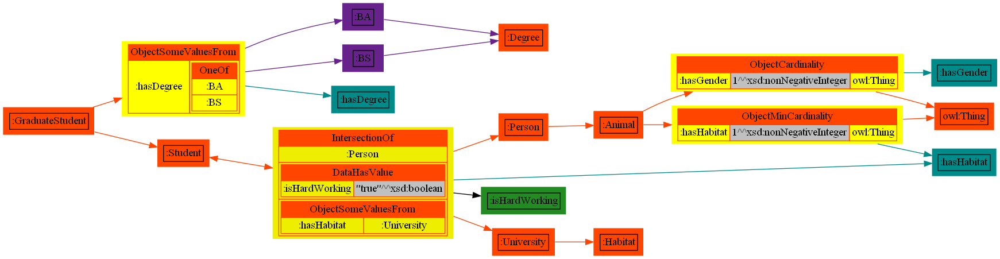

# Ontology Visualizer (DOT Writer)

## Summary

ONT-DOT is a tool for visualizing OWL and RDF ontologies, using [Graphviz](http://graphviz.gitlab.io/).

##### Useful links:

- https://graphviz.org/
- https://dreampuf.github.io/GraphvizOnline/

##### Build and run:

```shell
$ git clone git@github.com:sszuev/ont-dot.git
$ cd ont-dot
$ mvn clean package
$ java -jar target/ont2dot.jar
```

#### Options:

```text
usage: -i <path-to-input-rdf-file> [-if <format>] [-o <output-file-dot>]|[-b][-v][-u] [-e filterEntities]
-b,--browse                Tells the program to open the result graph in the default browser.
-e,--entities <arg>        A list of entities to filter, full or short (prefixed) IRIs, dot as separator,
example for pizza-ontology: '-e :Veneziana,:Germany'
-h,--help                  Display usage
-i,--input <arg>           The source OWL RDF-ontology file path (e.g. ttl)
-if,--input-format <arg>   The input format. Optional: if not specified the program will choose the most
suitable one to load ontology from a file. Must be one of the following: TURTLE,
RDF_XML, RDF_JSON, JSON_LD, NTRIPLES, NQUADS, TRIG, TRIX, RDF_THRIFT
-o,--output <arg>          The output file to write dot-content. Optional: if not specified the program will
print result to stdout.
-u,--url                   Print as url (suitable for small documents).
-v,--verbose               To print progress messages and logs to console.
```

##### Requirements:

- Git
- Java **11**
- Maven **3+**

##### License

* Apache License Version 2.0

##### Example:

